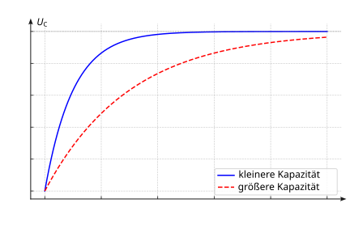

# Lernaufgabe DB12 Kapitel 1.5 Ladedauer

1. Beim Kondensator mit der größeren Kapazität dauert es länger, bis der Kondensator auf die gleiche Spannung aufgeladen ist. Der Ladevorgang geht also langsamer vonstatten, d.h. im $t$-$U$-Diagramm liegt die Kurve für die größere Kapazität unter der Kurve für die kleinere Kapazität und erreicht den asymptotischen Zustand später.
   
2. 