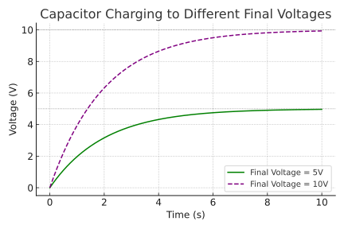
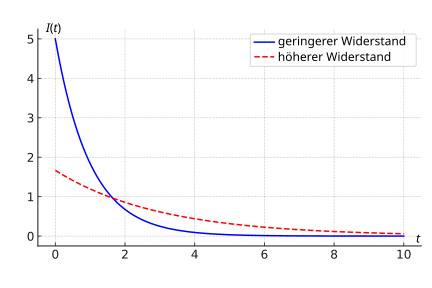

# Lernaufgabe DB12 Kapitel 1.5 Ladedauer

1. Es ist zu beachten: Die folgenden Überlegungen erfolgen bei sonst **gleichen** Bedingungen. 
   Beim Kondensator mit der größeren Kapazität dauert es länger, bis der Kondensator auf die gleiche Spannung aufgeladen ist. Der Ladevorgang geht also langsamer vonstatten, d.h. im $t$-$U$-Diagramm liegt die Kurve für die größere Kapazität unter der Kurve für die kleinere Kapazität und erreicht den asymptotischen Zustand später.
   
   Wenn *bei sonst gleichen Bedingungen* auf eine höhere Spannung geladen wird, dauert der Ladevorgang ebenfalls länger. In der Praxis bedeutet das, dass man den Ladevorgang vor Erreichen der maximalen Spannung abbricht.
   
   Wird der Widerstand im Stromkreis vergrößert, ist zu Beginn des Aufladevorgangs die Stromstärke immer kleiner als bei geringerem Widerstand. Da die Fläche unter dem Graphen ein Maß für die Ladungsmenge ist, dauert der Ladevorgang länger,  um die gleiche Ladungsmenge zu transportieren. Zu beachten: Im Laufe des Ladevorgangs schneiden sich beide Graphen, d.h. die logische Schlussfolgerung "Die Stromstärke ist damit stets kleiner als vorher" gilt nur für den Beginn.
    
2. Experimente klären grundsätzliche Zusammenhänge zwischen den Größen; unterstützen Verständnis der Vorgänge im Kondesnator; Vorbereitung auf mathematische Modellierung
3. a) mögliche Faktoren sind: $R$,  $C$
   b) 
4. Durchführung:
   - *Abhängigkeit von C*
     Die entladenen Kondensatoren werden nacheinander in die Messanordnung eingebaut. Der ohmsche Widerstand bleibt unverändert. Das Voltmeter sollte 0V anzeigen. Beim Umlegen des Schalters wird gleichzeitig die Uhr gestartet. Wenn die Anzeige des Voltmeters nicht mehr steigt, wird die Zeit gestoppt. Die so gemessene Ladezeit wird in sinnvolle gleiche Abschnitte eingeteilt, so dass 5 bis 10 Messwerte aufgenommen werden können. Zu jedem Zeitabschnitt wird die Spannung am Kondensator bestimmt.
     Die Versuchsreihe wird nun mit einem anderen ohmschen Widerstand wiederholt.
   - *Abhängigkeit von R*
     Der Versuch wird nun bei vorgegebenem $C$ mit verschiedenen ohmschen Widerständen durchgeführt.
Auswertung: 
Je größer der Widerstand und je größer die Kapazität, desto langsamer verläuft der Ladevorgang. Der Verlauf entspricht einer Wachstumsfunktion mit $U_0$ als Grenzwert.

   

   